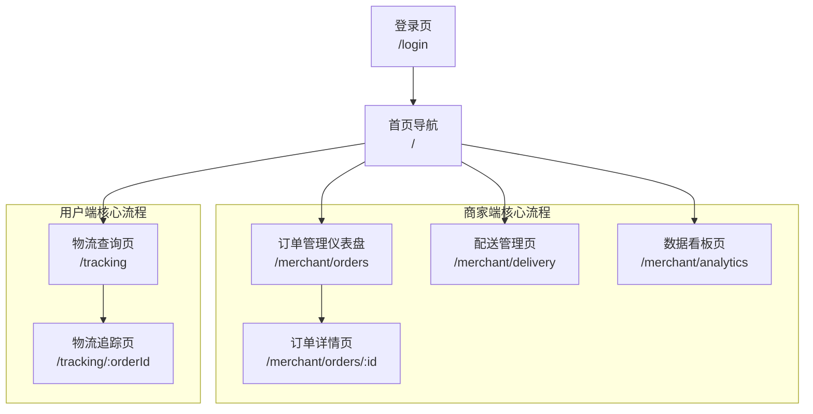

# User Flow — 电商物流配送可视化平台

```mermaid
graph TD
  %% Primary Entry Pages
  Login["登录页<br/>/login"]
  Home["首页导航<br/>/"]

  Login --> Home

  %% Merchant Side - Core Business Features
  subgraph "商家端核心流程"
    OrderDashboard["订单管理仪表盘<br/>/merchant/orders"]
    OrderDetail["订单详情页<br/>/merchant/orders/:id"]
    DeliveryManagement["配送管理页<br/>/merchant/delivery"]
    DataDashboard["数据看板页<br/>/merchant/analytics"]
  end

  Home --> OrderDashboard
  Home --> DeliveryManagement
  Home --> DataDashboard

  OrderDashboard --> OrderDetail

  %% User Side - Core Business Features
  subgraph "用户端核心流程"
    TrackingQuery["物流查询页<br/>/tracking"]
    TrackingDetail["物流追踪页<br/>/tracking/:orderId"]
  end

  Home --> TrackingQuery
  TrackingQuery --> TrackingDetail
```
